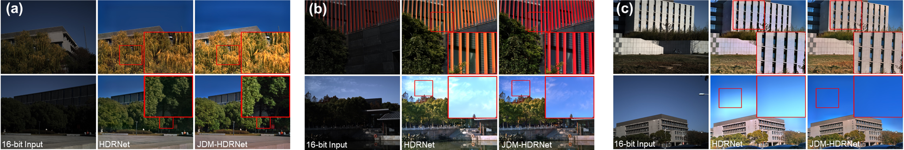
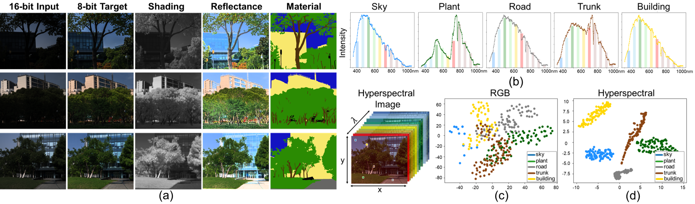

# Joint RGB-Spectral Decomposition Model Guided Image Enhancement in Mobile Photography (ECCV2024)


<p align="center">
   <a href='https://arxiv.org/pdf/2407.17996v1'>
      
   </a>
  
  
</p>

Abstract: The integration of miniaturized spectrometers into mobile devices offers new avenues for image quality enhancement and facilitates
novel downstream tasks. However, the broader application of spectral sensors in mobile photography is hindered by the inherent complexity
of spectral images and the constraints of spectral imaging capabilities. To overcome these challenges, we propose a joint RGB-Spectral decomposition model guided enhancement framework, which consists of two steps: joint decomposition and prior-guided enhancement. Firstly, we leverage the complementarity between RGB and Low-resolution MultiSpectral Images (Lr-MSI) to predict shading, reflectance, and material semantic priors. Subsequently, these priors are seamlessly integrated into the established HDRNet to promote dynamic range enhancement, color
mapping, and grid expert learning, respectively. Additionally, we construct a high-quality Mobile-Spec dataset to support our research, and
our experiments validate the effectiveness of Lr-MSI in the tone enhancement task. This work aims to establish a solid foundation for advancing spectral vision in mobile photography. 


<div align="center" style="width:image width px;">
  
</div>

Benefits of Low-resolution MultiSpectral Images (Lr-MSI):  (a)
S: enhanced dynamic range; (b) R: more accurate color; (c) M: context consistency.


## Mobile-Spec dataset
<div align="center" style="width:image width px;">
  
</div>

```bash
Mobile-Spec dataset contains both aligned hyperspectral and RGB images:
a.hyperspectral image: 0-65535, 400-1000nm (176 bands), captured by scanning hyperspectral cameras;
b.16-bit input RGB image: 0-65535, fusion of multiple exposure frames, captured by smartphones;
c.8-bit target RGB image: 0-255, tone mapped targets;
d.shading image: approximated by near-infrared (850-1000nm) images;
e.materical segmentation image: labeled by human annotators;
```

## Usage


### 1.Installation
```bash
# dependencies
pytorch      1.8.1
tensorboard  2.9.1 
torchvision  0.9.1                
python       3.9.12              
numpy        1.22.3          
einops       0.4.1                 
matplotlib   3.6.1  
# install einops
pip intall einops                 
```
### 2.Dataset
Download the `Mobile-Spec` dataset from [NJU-Box](https://box.nju.edu.cn/d/521896e2fdf84ae7996a/), [Google Drive](https://drive.google.com/file/d/14nhLzAOM4WM3Ny4NhWwho3lMGMfzQ70t/view?usp=drive_link)  or [Baidu Cloud (code: tcpg)](https://pan.baidu.com/s/1yTDHwim2oPJe3Zu_uxcZ_A?pwd=tcpg)  as
 

```bash
|-Mobile-Spec
|---train
|---|---nir  
|---|---nir_jdm
|---|---seg
|---|---seg_jdm
|---|---source
|---|---spec_npy10band
|---|---target
|---eval
|---|---nir
|---|---nir_jdm
|---|---seg
|---|---seg_jdm
|---|---source
|---|---spec_npy10band
|---|---target
```
The original hyperspectral images (`.mat` format, about 54GB) can be downloaded from  [Baidu Cloud (code:7hc2)](https://pan.baidu.com/s/1XLjxEgx0EPCUd7-7dLbdrQ?pwd=7hc2).

### 3.Train
```bash
# train from ideal value of S,R,M priors
python train.py --epochs=6000 --train_data_dir=/home/calay/DATASET/Mobile-Spec/train/ --eval_data_dir=/home/calay/DATASET/Mobile-Spec/eval/ --hdr --cuda --spec --material_mask
# train from S,R,M priors predcited from joint decomposition model
python train.py --epochs=6000 --train_data_dir=/home/calay/DATASET/Mobile-Spec/train/ --eval_data_dir=/home/calay/DATASET/Mobile-Spec/eval/ --hdr --cuda --spec --material_mask  --jdm_predict
```
change the `--train_data_dir` and `--eval_data_dir` to your own path.

### 4.Evaluation
```bash
# JDM-HDRNet* (ideal value of S,R,M priors)
python test.py --train_data_dir=/home/calay/DATASET/Mobile-Spec/train/ --eval_data_dir=/home/calay/DATASET/Mobile-Spec/eval/ --hdr --cuda --spec --material_mask --ckpt_dir ./ckpts_idea_srm/
# JDM-HDRNet (S,R,M priors predcited from joint decomposition model)
python test.py --train_data_dir=/home/calay/DATASET/Mobile-Spec/train/ --eval_data_dir=/home/calay/DATASET/Mobile-Spec/eval/ --hdr --cuda --spec --material_mask --ckpt_dir ./ckpts_jdm_srm/ --jdm_predict
```
change the `--train_data_dir` and `--eval_data_dir` to your own path.

```bash
# evaluate PSNR, SSIM, and delta E
1.change <gt_path> in average_psnr_ssim.m
2.run average_psnr_ssim.m in MATLAB
```

### 5.Joint RGB-Spectral Decomposition Model
Please download `Mobile-Spec_jdm` dataset from [NJU-BOX](https://box.nju.edu.cn/d/ec0fbac5de90426685fc/) or [Baidu Cloud (code:q9tk)](https://pan.baidu.com/s/13wez1JsR8i52sOaU3sm_cQ?pwd=q9tk), and download the trained model `jdm_iter_14000.pth` ([NJU-BOX](https://box.nju.edu.cn/f/342f71c245d84c999950/?dl=1) or [Baidu Cloud (code:5iz8)](https://pan.baidu.com/s/166nOmwh7QmIwI5uOFU5DAA?pwd=5iz8)) to `./work_dirs/`.
```bash
## 1.install mmsegmentation-0.22 (please notice version correspondence of mmcv, cuda and torch)
cd segmentation-jdm/
pip install -v -e .
# you should execute the following commmand afer changing the code
python setup.py install
## 2.dataset
change <data_root> in experiments/_base_/datasets/hsicity2-rgb.py (line2)
## 3.test
python tools/test.py ./experiments/hsicity2-survey-rgb/fcn_r50-d8_0.25x_20k_hsicity2rgb.py ./work_dirs/jdm_iter_14000.pth --eval_hsi True
--show-dir ./work_dirs/jdm_predict/ --opacity 1 --eval mIoU
##4 train
python tools/train.py ./experiments/hsicity2-survey-rgb/fcn_r50-d8_0.25x_20k_hsicity2rgb.py
```

## LICENSE

- Code: [MIT LICENSE](./LICENSE)
- Dataset: The Mobile-SPec dataset is licensed under <a href="https://creativecommons.org/licenses/by-nc-sa/4.0/?ref=chooser-v1" target="_blank" rel="license noopener noreferrer" style="display:inline-block;">Creative Commons Attribution-NonCommercial-ShareAlike 4.0 International</a></p>


## Citation
```
@inproceedings{JDM-HDRNet_ECCV2024,
title     = {Joint RGB-Spectral Decomposition Model Guided Image Enhancement in Mobile Photography},
author    = {Zhou, Kailai and Cai, Lijing and Wang, Yibo and Zhang, Mengya and Wen, Bihan  and Shen, Qiu and Cao, Xun},
booktitle = ECCV,
year      = {2024}
}
```

